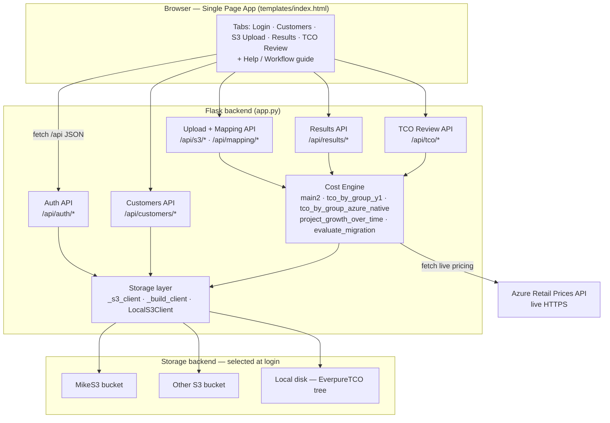
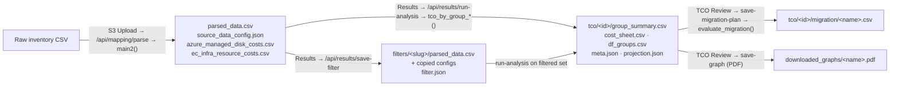

# Software Architecture — Everpure Azure Managed Disk Visualization Tool

This document describes the primary functions of the solution, their inputs and outputs
(including every file the solution creates), and how the pieces fit together.

The whole application is two files:

- **`app.py`** — the entire Flask backend: `/api/*` endpoints, the cost engine, and the
  storage layer.
- **`templates/index.html`** — the entire single-page frontend (tabbed UI with inline JS/CSS).

All persistent state is stored as objects/files in a **storage backend chosen at login**
(MikeS3, Other S3, or Local disk) under a common `TCO-GUI/…` key/path layout.

---

## 1. Component / layer diagram



**Storage layer note.** Every read/write goes through a boto3-S3-shaped client. For S3 backends
it is a real boto3 client; for Local Storage it is `LocalS3Client`, which emulates the same API
(`get_object`, `put_object`, `list_objects_v2`, `copy_object`, `delete_object(s)`, `head_object`)
against a directory tree. The backend is resolved per session, so all higher-level functions are
storage-agnostic.

---

## 2. End-to-end data flow (with files created)



---

## 3. Primary functions — inputs, outputs, and files created

### Authentication & storage selection
| Function / endpoint | Inputs | Outputs | Files created |
|---|---|---|---|
| `POST /api/auth/login` → `_storage_write_test`, `_ensure_backend_configs` | username, password, storage choice (MikeS3 / Other S3 bucket+keys / Local drive) | session (logged-in + storage backend); write-test pass/fail | health-check object (written then deleted); seeds `pscd_config.json` + `ecan_config.json` into a new backend |
| `_build_client` / `_s3_client` / `LocalS3Client` | session storage config | a storage client (S3 or local) | — (I/O layer used by everything below) |

### Customers
| Function / endpoint | Inputs | Outputs | Files created |
|---|---|---|---|
| `/api/customers` add / select / delete / scenario | customer name, scenario | active customer + scenario in session | `TCO-GUI/_config/customer_list.json` |

### Upload & column mapping
| Function / endpoint | Inputs | Outputs | Files created |
|---|---|---|---|
| `POST /api/s3/presign` + `confirm`, or `POST /api/s3/local-upload` | file metadata / the file | presigned URL (S3) or direct write (local) | `…/<datetime>/data/<upload>.csv` |
| `POST /api/mapping/analyze` | uploaded CSV | headers, auto-mapping, 3-row data preview, per-column samples | — |
| `POST /api/mapping/parse` → **`main2(event, df_all)`** | raw CSV(s) + column-index mapping | parsed inventory (volumes/VMs grouped), cost summary | `…/results/parsed_data.csv`, `…/results/source_data_config.json`, plus cached pricing `…/results/azure_managed_disk_costs.csv`, `…/results/ec_infra_resource_costs.csv` |
| `GET/POST/DELETE /api/mapping/templates` | mapping template | saved templates | `TCO-GUI/_config/mapping_templates.json` |
| `GET/PUT /api/mapping/fields` | learned header aliases | field catalog | `TCO-GUI/_config/data_fields_aliases.json` |
| `gen_price_list_azure`, `get_pscd_size_n_cost_data` | region/SKU list + **live Azure Retail Prices API** | Azure managed-disk & EC infra price tables | `azure_managed_disk_costs.csv`, `ec_infra_resource_costs.csv` (cached in the run's `results/`) |

### Results — filtering & running analysis
| Function / endpoint | Inputs | Outputs | Files created |
|---|---|---|---|
| `GET /api/results/list`, `POST /api/results/detail` → `_compute_detail_metrics` | parsed_data.csv + its config | KPIs + region / disk-type / group breakdowns | — |
| `POST /api/results/filter-preview` / `filter-detail` | parsed_data.csv, search terms, include/exclude | matched/kept counts, sample rows, filtered summary | — |
| `POST /api/results/save-filter` | parsed_data.csv, terms, mode, label | a new self-contained filtered dataset | `…/results/filters/<slug>_<stamp>/parsed_data.csv` + copied `source_data_config.json`, cost CSVs, and `filter.json` |
| `POST /api/results/run-analysis` → **`tco_by_group_y1`** (Dedicated) **or `tco_by_group_azure_native`** (Azure Native) → `project_growth_over_time` | parsed_data.csv + parameters (growth, DRR, snapshot, efficiency, SKU, years, cycle, deployment model); reads `pscd_config.json` / `ecan_config.json` + cost CSVs | per-group TCO, multi-year cost sheet, growth projection | `…/results/tco/<id>/group_summary.csv`, `cost_sheet.csv`, `df_groups.csv`, `meta.json`, `projection.json` |

### TCO Review
| Function / endpoint | Inputs | Outputs | Files created |
|---|---|---|---|
| `GET /api/tco/list`, `POST /api/tco/detail`, `dfgroups` | customer / group_summary key | run list, per-group tables (Data/Advanced views) | — |
| `POST /api/tco/projection` (read) / `project` (recompute) → `project_growth_over_time` | run + growth params | growth series over time | `…/tco/<id>/projection.json` |
| `POST /api/tco/evaluate` + `save-migration-plan` → **`evaluate_migration(df, params)`** | group_summary + capacity/month, per-group precedence & order | month-by-month migration schedule, prorated Everpure vs unmigrated Azure, cumulative arrays | `…/tco/<id>/migration/<name>_<stamp>.csv` |
| `GET /api/tco/migration-plans`, `migration-plan` | run | list / one plan's per-group timeline | — |
| `POST /api/tco/save-graph` | rendered graph HTML | server-side PDF (WeasyPrint, else headless Chrome/Edge) | `TCO-GUI/<user>/<customer>/downloaded_graphs/<name>_<stamp>.pdf` |
| `GET/POST /api/tco/links` | primary / follower selection | linkage state | `TCO-GUI/<user>/<customer>/_tco_links.json` |
| `POST /api/tco/delete`, download-url, download-delete, compare | run key(s) | delete / signed download / comparison data | — |

---

## 4. Files created — full reference

Object keys (S3) / paths (local, under `<DRIVE>:\EverpureTCO\`) share this layout:

```
TCO-GUI/
├─ _config/
│   ├─ customer_list.json          # customers (created/updated by Customers API)
│   ├─ pscd_config.json            # PSCD sizing config  [INPUT — required by Dedicated]
│   ├─ ecan_config.json            # Azure Native pricing config  [INPUT — required by Azure Native]
│   ├─ mapping_templates.json      # saved column-mapping templates
│   └─ data_fields_aliases.json    # learned header→field aliases
│
└─ <username>/<customer>/
    ├─ _tco_links.json             # primary/follower linkage for TCO runs
    ├─ downloaded_graphs/
    │   └─ <name>_<stamp>.pdf       # exported TCO graph PDFs
    └─ <scenario>/<datetime>/
        ├─ data/
        │   └─ <upload>.csv         # raw uploaded inventory
        └─ results/
            ├─ parsed_data.csv               # parsed inventory  (main2)
            ├─ source_data_config.json       # column mapping used  (main2)
            ├─ azure_managed_disk_costs.csv   # cached Azure disk pricing
            ├─ ec_infra_resource_costs.csv    # cached EC/PSCD infra pricing
            ├─ filters/
            │   └─ <slug>_<stamp>/            # a saved use-case-filtered dataset
            │       ├─ parsed_data.csv
            │       ├─ source_data_config.json
            │       ├─ azure_managed_disk_costs.csv
            │       ├─ ec_infra_resource_costs.csv
            │       └─ filter.json            # filter terms/mode/kept counts
            └─ tco/
                └─ <id>/                      # one generated TCO run
                    ├─ group_summary.csv      # per-group TCO summary
                    ├─ cost_sheet.csv         # multi-year cost detail
                    ├─ df_groups.csv          # raw per-group sizing
                    ├─ meta.json              # run params + description (+ filter info)
                    ├─ projection.json        # growth projection series
                    └─ migration/
                        └─ <name>_<stamp>.csv # a saved migration plan
```

**Legend:** `[INPUT]` files are provided/seeded (not produced by a run); everything else is
created by the solution as users move through the workflow.

---

## 5. External dependencies

| Dependency | Used by | Purpose |
|---|---|---|
| **Azure Retail Prices API** (public HTTPS) | `gen_price_list_azure`, `get_pscd_size_n_cost_data` | live Azure managed-disk pricing for each analysis |
| **Amazon S3** (boto3) | storage layer | MikeS3 / Other S3 backends |
| **Local filesystem** | `LocalS3Client` | Local Storage backend |
| **WeasyPrint** *(optional)* / **headless Chrome or Edge** | `POST /api/tco/save-graph` | render TCO graphs to PDF |
